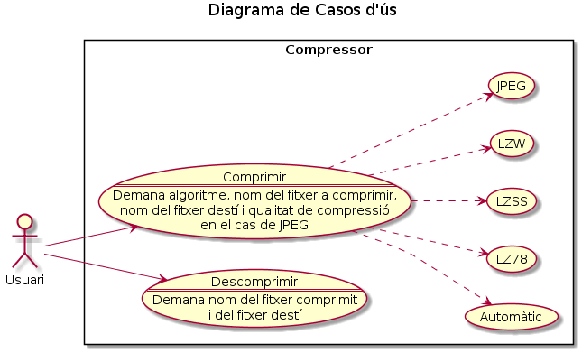
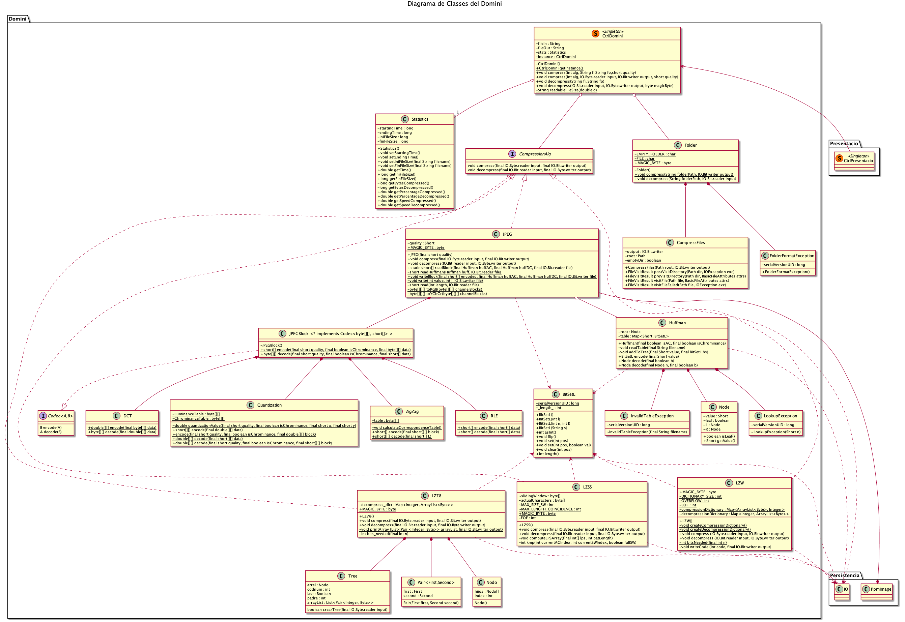
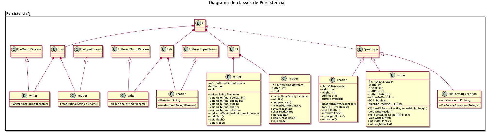
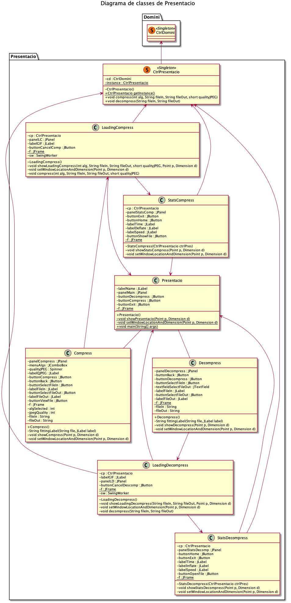

# El Compresor

Proyecto PROP Cuatrimestre Otoño 2019/20

## Miembros del grupo

- ***REMOVED*** <***REMOVED***>
- ***REMOVED*** <***REMOVED***>
- ***REMOVED*** <***REMOVED***>
- ***REMOVED*** <***REMOVED***>

## Lista de clases y documentos implementados por cada miembro del grupo:

- **Clases**:
  - **JPEG**: ***REMOVED***
  - **LZ78**: ***REMOVED***
  - **LZW**: ***REMOVED***
  - **LZSS**: ***REMOVED***
  - **Folder**: ***REMOVED***
  - **JPEGBlock**: ***REMOVED***
  - **Huffman**: ***REMOVED***
  - **PpmImage**: ***REMOVED***
  - **BitSetL**: ***REMOVED***
  - **IO**: ***REMOVED***
  - **Statistics**: ***REMOVED***
  - **CtrlDomini**: ***REMOVED***
  - **CtrlPresentacio**:  ***REMOVED***
  - **Main**: ***REMOVED***
- **Interfaz gráfica de usuario**: toda hecha por ***REMOVED***
- **Juegos de prueba**: todos hechos por ***REMOVED***
- **Drivers**: ***REMOVED***
- **Documentación**:
  - **Diagramas de clase/Casos de uso**: ***REMOVED***
  - **Especificación detallada**: ***REMOVED***
  - **Explicación juegos de prueba**: ***REMOVED***
  - **Doxygen**: ***REMOVED***
  - **Explicación ED & Algoritmos**: ***REMOVED***

## Lista librerías externas

- **Forms_rt**: Hemos implementado la interfaz gráfica de usuario usando el
*designer* que nos proporcionaba el propio *IntelliJ IDEA* y necesitamos la
librería Forms_rt, de la cual usamos la versión 7.0.3, para generar todas las
inicializaciones de los componentes de gráficos que usamos (JLabel, JSpinner,
JButton, etc) acorde a lo especificado en el *designer*.
- **API Guardian/Hamcrest Core/JUnit Jupiter/Junit Jupiter Api/JUnit Platform
Console Standalone**: Todas estas librerías las usamos para hacer los test con
JUnit, muy necesarios para poder probar todos los componentes de nuestro
código por separado mientras los desarrollábamos o mejorábamos.

## Lista de funcionalidades implementadas:

### 1a Entrega:
- Los algoritmos LZs solo comprimían y descomprimían archivos de tipo `.txt`.
- El algoritmo JPEG comprimía archivos de tipo `.ppm`.
- Se generaban estadísticas de compresión y descompresión.

### 2a Entrega:
Además de las funcionalidades implementadas en la 1a entrega.
- **Obligatorio**:
    - Se permite comprimir y descomprimir carpetas (con subcarpetas y/o todo tipo de archivos).
    - En esta segunda entrega hemos implementado una interfaz gráfica con la que interactua el usuario, en lugar de con la consola.
    - Con esta interfaz gráfica se permite la visualización de un fichero de entrada y su correspondiente descompresión despues de aplicar el proceso de compresión/descompresión con un cierto algoritmo.
- **Opcional**:
    - Hemos mejorado los algoritmos LZs de forma que ahora comprimen y descomprimen todo tipo de archivos.
    - Además el algoritmo LZ78 ahora implementa la compresión con `Tree`.

## Diagramas

### Diagrama Casos de Uso

### Diagramas de Clases

