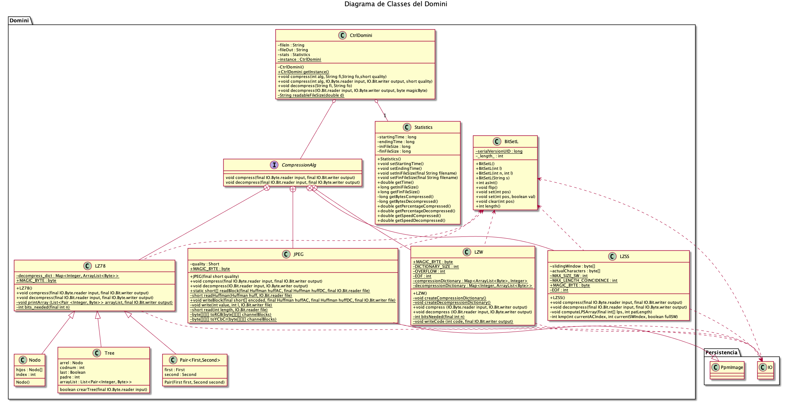
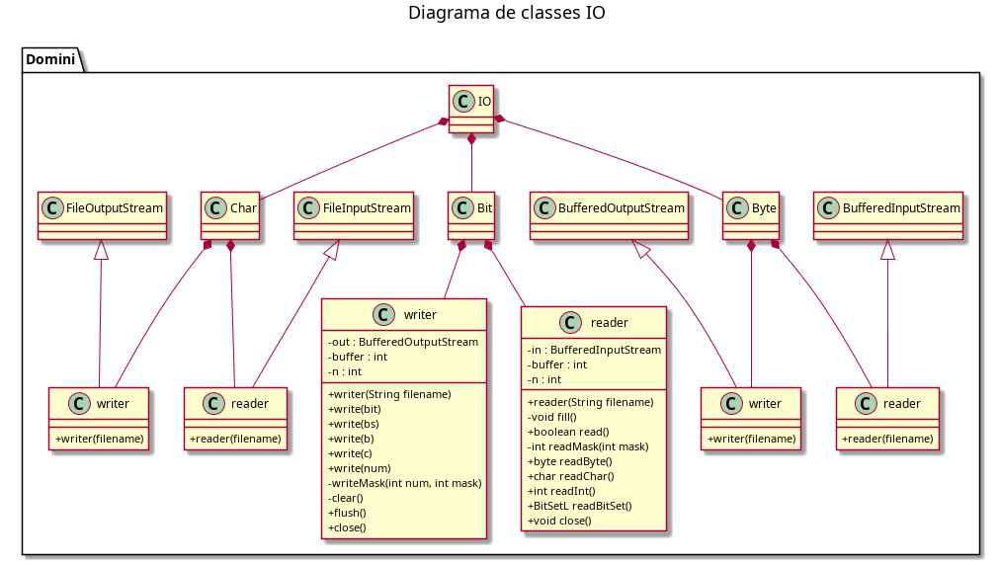
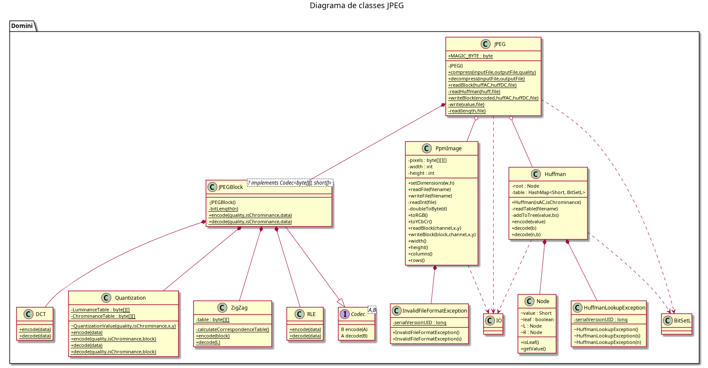

# El Compressor

Projecte PROP Quatrimestre tardor 2019/20

## Miembros del grupo

- Boné Ribó, Aleix <aleix.bone@est.fib.upc.edu>
- Gonzàlez Godoy, Alex <alex.gonzalez.godoy@est.fib.upc.edu>
- Herrero Pons, Alex <alex.herrero.pons@est.fib.upc.edu>
- Mercadé Plasencia, Albert <albert.mercade.plasencia@est.fib.upc.edu>

## Lista de classes implementadas por cada miembro:

- **JPEG**: Aleix Boné
- **LZ78**: Alex González
- **LZW**: Alex Herrero
- **LZSS**: Alber Mercadé

- **JPEGBlock**: Aleix Boné
- **Huffman**: Aleix Boné
- **PpmImage**: Aleix Boné
- **BitSetL**: Aleix Boné
- **IO**: Alex González
- **Statistics**: Alex Herrero
- **CtrlDomini**: Albert Mercadé
- **CtrlPresentacio**:  Albert Mercadé
- **Main**: Alex Herrero

## Uso de la aplicación

Compilar aplicacion:
```bash
make
```

Ejecutar:
```bash
make run
```
Crear jar (`target/ProjecteProp-1.0-SNAPSHOT.jar`):
```bash
make jar
```

### JUnit5

Compilar tests JUnit:
```bash
make build_test
```
Ejecutar tests JUnit:
```bash
make run_test
```

### Drivers
Para compilar y ejecutar los drivers:
```bash
bash ./buildRunDriver.sh NombreDeClasseAProbar
# Ejemplo para JPEGDriver:
bash ./buildRunDriver.sh JPEG
```

## Diagramas

### Diagrama Casos d'Us


### Diagrames de Classes




