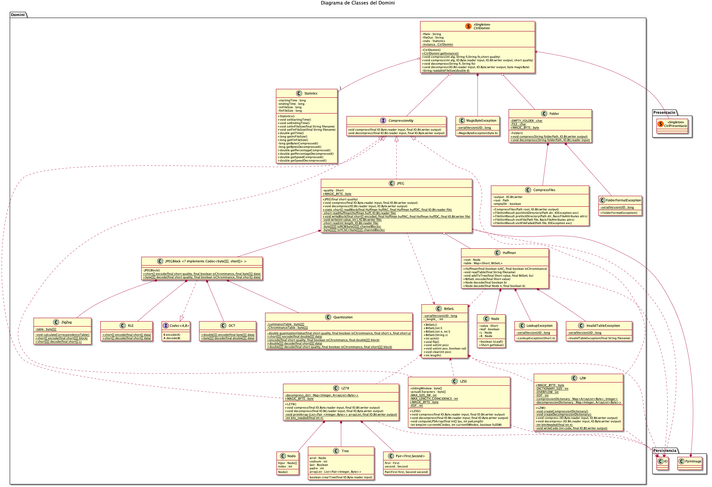

# El Compresor

Proyecto PROP Cuatrimestre Otoño 2019/20

## Miembros del grupo

- Boné Ribó, Aleix <aleix.bone@est.fib.upc.edu> Gonzàlez Godoy, Alex
  <alex.gonzalez.godoy@est.fib.upc.edu> Herrero Pons, Alex
  <alex.herrero.pons@est.fib.upc.edu> Mercadé Plasencia, Albert
  <albert.mercade.plasencia@est.fib.upc.edu>

## Lista de clases y documentos implementados por cada miembro del grupo:

- **Clases**:
  - **JPEG**: Aleix Boné
  - **LZ78**: Alex González
  - **LZW**: Alex Herrero
  - **LZSS**: Alber Mercadé
  - **Folder**: Aleix Boné
  - **JPEGBlock**: Aleix Boné
  - **Huffman**: Aleix Boné
  - **PpmImage**: Aleix Boné
  - **BitSetL**: Aleix Boné
  - **IO**: Alex González
  - **Statistics**: Alex Herrero
  - **CtrlDomini**: Albert Mercadé
  - **CtrlPresentacio**:  Albert Mercadé
  - **Main**: Alex Herrero
- **Interfaz gráfica de usuario**: toda hecha por Albert Mercadé
- **Juegos de prueba**: todos hechos por Alex González
- **Drivers**: Alex Herrero
- **Documentación**:
  - **Diagramas de clase/Casos de uso**: Albert Mercadé
  - **Especificación detallada**: Alex González
  - **Explicación juegos de prueba**: Alex González
  - **Doxygen**: Alex Herrero
  - **Explicación ED & Algoritmos**: Alex Herrero

## Lista librerías externas

- **Forms_rt**: Hemos implementado la interfaz gráfica de usuario usando el
*designer* que nos proporcionaba el propio *IntelliJ IDEA* y necesitamos la
librería Forms_rt, de la cual usamos la versión 7.0.3, para generar todas las
inicializaciones de los componentes de gráficos que usamos (JLabel, JSpinner,
JButton, etc) acorde a lo especificado en el *designer*.
- **API Guardian/Hamcrest Core/JUnit Jupiter/Junit Jupiter Api/JUnit Platform
Console Standalone**: Todas estas librerías las usamos para hacer los test con
JUnit, muy necesarios para poder probar todos los componentes de nuestro
código por separado mientras los desarrollábamos o mejorábamos.

## Diagramas

### Diagrama Casos de Uso

### Diagramas de Clases

